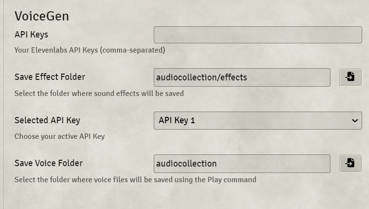
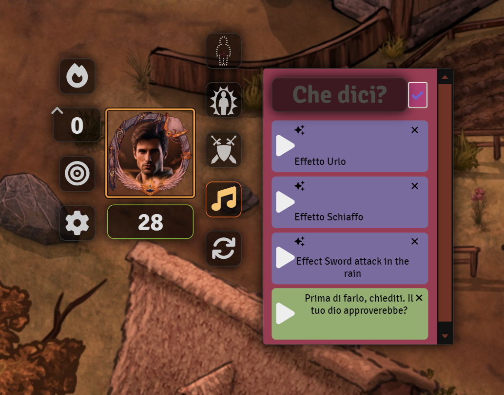

# VoiceGen Module

VoiceGen is a Foundry VTT module that allows Game Masters (GMs) and players to generate and manage sounds, including speech and sound effects, associated with tokens on the map. The module integrates with the ElevenLabs API to generate and play audio effects and manage them efficiently within the game.

## Table of Contents

1. [Installation](#installation)
2. [Configuration](#configuration)
3. [Features](#features)
   - [Token Voices](#token-voices)
   - [Token Effects](#token-effects)
   - [History](#history)
   - [API](#api)
   - [Change Lyrics](#change-lyrics)
4. [Functions](#functions)
5. [Usage](#usage)
   - [Creating Token Voices](#creating-token-voices)
   - [Creating Token Effects](#creating-token-effects)
   - [Managing Sounds](#managing-sounds)
   - [Playing Sounds](#playing-sounds)
   - [Editing Lyrics](#editing-lyrics)
6. [Changelog](#changelog)
7. [License](#license)

## Installation

1. Download the module from the Foundry VTT module repository.
2. Place the module in the `modules` directory of your Foundry VTT installation.
3. Activate the module from the `Manage Modules` menu in Foundry VTT.

## Configuration

Before using VoiceGen, you need to configure a few settings:

1. **API Key**: Set your ElevenLabs API key.
2. **Save Voice Folder**: Configure the folder where voice files will be saved.
3. **Save Effect Folder**: Configure the folder where sound effect files will be saved.

To configure these settings:
1. Go to the `Settings` tab in Foundry VTT.
2. Click on `Configure Settings`.
3. Select `Module Settings`.
4. Locate `VoiceGen` and set the required configurations.
<br>

## Features

### Token Voices
VoiceGen allows you to generate and manage voices associated with tokens on the map. This includes playing sounds, generating speech, and editing sound details.
<br>


### Token Effects
Generate sound effects associated with specific tokens, saving them in a designated folder. If a token is selected, the effect will be saved in a subfolder named after the token.

### History
Maintain a history of generated sounds for easy reference and playback.
<br>
  
### API
VoiceGen provides an API for programmatic interaction with the module.

### Change Lyrics
Edit the lyrics of existing sound files directly within Foundry VTT.

## Functions

### Generate_Sound_Effect

Generates a sound effect and saves it in the appropriate folder based on whether a token is selected.

**Parameters**:
- `effectDescription`: Description of the sound effect.
- `filename`: Name of the file to save the sound effect as.
- `duration`: Duration of the sound effect in seconds (default: 3).

### Play_Sound

Handles various sound-related commands.

**Parameters**:
- `message`: The command message to process.

### Play_Sound_HUD

Generates and plays a sound based on the provided lyrics and token name.

**Parameters**:
- `lyrics`: The lyrics for the sound.
- `tokenName`: The name of the token.

### Get_Userdata

Fetches user data from the ElevenLabs API.

### Get_Voices

Fetches available voices from the ElevenLabs API.

### saveFile

Saves a file to the specified path.

**Parameters**:
- `buffer`: The file data.
- `filePath`: The path to save the file.

### markFileAsDeleted

Marks a file as deleted by changing its lyrics to "DELETED".

**Parameters**:
- `filePath`: The path of the file.
- `file`: The file metadata.
- `tokenFolder`: The folder of the token.
- `mp3Files`: The list of mp3 files.

### saveUpdatedLyrics

Updates the lyrics of a file and saves it.

**Parameters**:
- `filePath`: The path of the file.
- `newLyrics`: The new lyrics.

### refreshMP3Metadata

Refreshes the metadata of mp3 files.

**Parameters**:
- `tokenFolder`: The folder of the token.
- `tokenName`: The name of the token.

### getCachedMP3Metadata

Gets cached metadata of mp3 files.

**Parameters**:
- `tokenFolder`: The folder of the token.
- `tokenName`: The name of the token.

### fetchMP3Metadata

Fetches metadata of mp3 files.

**Parameters**:
- `tokenFolder`: The folder of the token.

### updateMP3MetadataCache

Updates the cache of mp3 metadata.

**Parameters**:
- `tokenFolder`: The folder of the token.
- `mp3Files`: The list of mp3 files.

### showEditDialog

Shows a dialog to edit the lyrics of a file.

**Parameters**:
- `filePath`: The path of the file.
- `file`: The file metadata.
- `tokenFolder`: The folder of the token.
- `mp3Files`: The list of mp3 files.

### runPlaySound

Plays a sound from the provided chunks of data.

**Parameters**:
- `chunks`: The sound data chunks.

### Fetch_History

Fetches the history of generated sounds.

### doStuff

A placeholder function for additional actions.

## Usage

### Creating Token Voices

To create a token voice, use the `/playsound` command followed by the voice name in square brackets and the text:

```
/playsound [voiceName] Text to generate
```

Alternatively, you can use the HUD to generate token voices:

1. Select the token.
2. Click on the sound icon in the token HUD.
3. Enter the text in the input box and click "Create".

### Creating Token Effects

To create a token effect, use the `/effect` command followed by the description, optional duration in parentheses, and the filename:

```
/effect [description] (duration) filename.ext
```

If a token is selected, the effect will be saved in a subfolder named after the token.

### Managing Sounds

- **Generating Sound Effects**: Use the `/effect` command to generate sound effects.
- **Editing Lyrics**: Right-click on a sound icon and select "Edit Lyrics" to modify the lyrics.

### Playing Sounds

- Click on the play icon next to a sound to play it.
- Use the `/playsound` command to play sounds with specific voices and texts.

### Editing Lyrics

To edit the lyrics of a sound:
1. Right-click on the sound icon.
2. Select "Edit Lyrics".
3. Enter the new lyrics and save.

### History

Fetch and manage the history of generated sounds:

- Use the `/history` command to fetch the history of generated sounds.

### API

VoiceGen provides an API for programmatic interaction with the module. You can access the API functions using `game.modules.get('aedifs-token-sounds').api`.

**Available API functions**:
- `Initialize_Main`
- `Get_Userdata`
- `Play_Sound_HUD`
- `Play_Sound`
- `runPlaySound`
- `Get_Voices`
- `Text_To_Speech`
- `Generate_Sound_Effect`
- `getAmbientSoundOptions`
- `saveFile`
- `Fetch_History`
- `Fetch_History_Audio`
- `Show_History_Dialog`
- `Voice_Field`
- `Send_Text_To_Speech`
- `doStuff`
- `sleep`
- `Create_Window`
- `Set_Key`
- `Set_Key_Window`

## Changelog

### Version 1.0.0
- Initial release with basic features for generating and managing token sounds and effects.

## License

This module is licensed under the MIT License.
